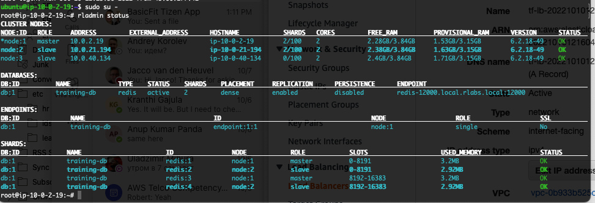
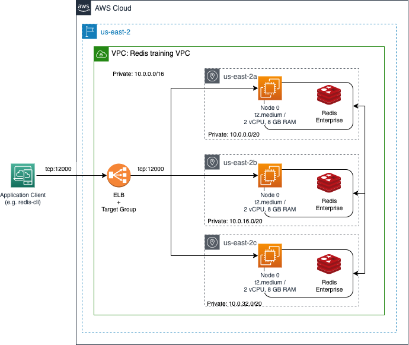

## Redis Cluster Installation artifact
 <strong>Disclaimer 1: it is not a production ready solution.</strong><br/>
 <strong>Disclaimer 2: artifact contains SSH keys (is_rsa & id_rsa.pub).</strong>


 
 <br/>
 
## Prerequisites

1) Obtain installation tarball (tar.gz) of Redis Enterprise.
   The name "redislabs-6.2.18-49-bionic-amd64.tar" is used by the current version of the artifact.
2) Place it into current directory
3) Edit the hosts_template file. It contains parameters used during by Ansible playbook
  - redis cluster name
  - admin account credentials
  - path to the tar.gz file
4) configure AWS account
5) install Terraform and Ansible

## Limitations
1) Installation uses AWS us-east-2 region. You can change it by modifying the main.tf file
2) AMI (ami-0a59f0e26c55590e9) Ubuntu 18.04 LTS is used to create EC2 instantce. Can be changed by modifying the main.tf file.
## Installation sequence:
1) define AWS_PROFILE variable (i.e. export AWS_PROFILE="my_aws_profile"
2) Run terraform
  ```bash
  $ terraform init && terraform apply
  ```
3) Run dump_nodes.sh to create Ansible inventory file.
  ```bash
  $ ./dump_nodes.sh
  ```
4) Run Ansible playbook
  ```bash
  $  ansible-playbook -i hosts redis.yaml
  ```
5) Solve issues which should not happen :))

6) Access any server using SSH.
   Open the ./hosts file. It contains public DNS names of the configured EC2 instances. SSH connection can be established using SSH key (id_rsa) stored in the current directory. Use the "ubuntu" user (e.g.):
   ```bash
   $ ssh -i id_rsa ubuntu@c2-3-140-188-58.us-east-2.compute.amazonaws.com
   ```
   ..and inspect the installation. For instance, use the 'sudo rladmin cluster' command
